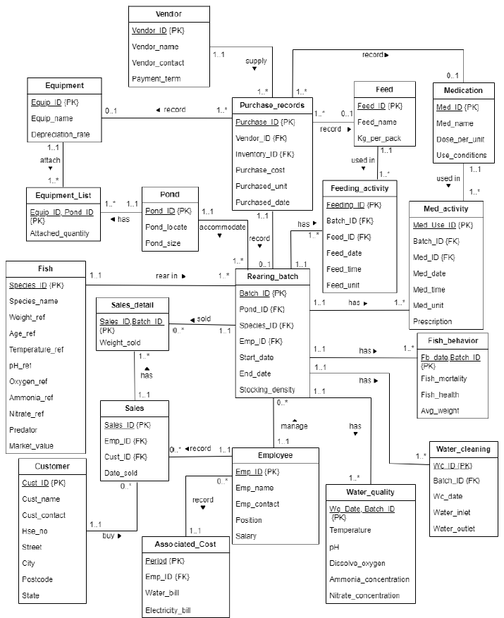

# Aquafarming_Management_System
This project is to design and develop a database system for Aquafarming Management. It is an end-to-end project starting from constructing the ERD model, examine physical design and eventually create a database application to meet the needs and situation defined from the case study. Besides, some queries are produced to extract some important information from the created database.

## Entity Relationship Model of the System

## Queries
1. Generate sales record by fish species
2. Calculate revenue
3. Calculate the expenses including water bill and electricity bill
4. Calculate the value of equipment including depreciation
5. Calculate the cost of inventories
6. Calculate the salary paid to employees
7. Calculate the biannual profit
   - Formula: Total revenue - (Total purchase cost + total utilities bill + total depreciation value + total salary paid)
8. Comparison between unhealthy batches of fish with the standard reference value based on its corresponding species
9. Promote the batch of fish to customer who bought the corresponding fish species before
